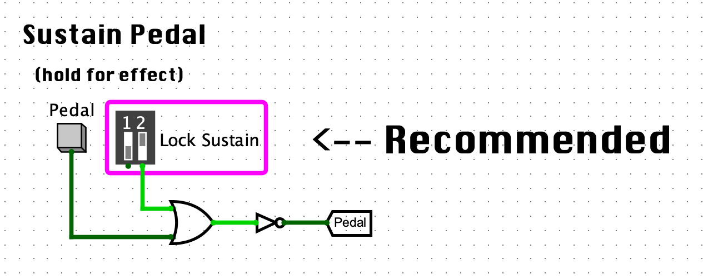
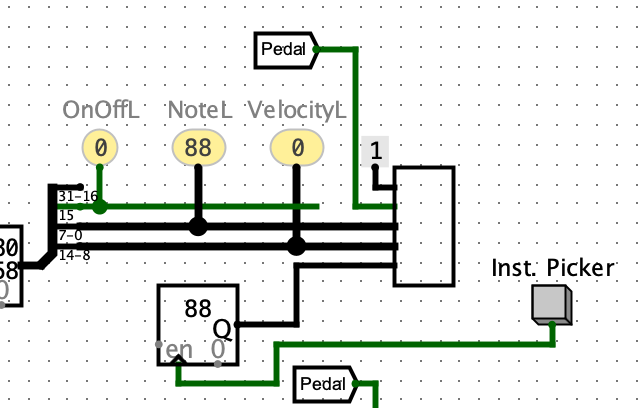

# Chillwave Generator
An engine that randomly generates chillwave music.

## Setup

1. Open 'randomMusic.circ' in Logisim-evolution (https://github.com/kevinawalsh/logisim-evolution).

2. If program memory (ROM 4k x 8) is not already populated...
- Right-click it. 
- Click 'Load Memory Image' and import the 'randomMusicMipsCode.txt' file.

3. If the 'kahdeg MIDI' folder doesn't already exist in the top left-hand menu...
- Go to 'Project->Load Library' and select 'JAR Library'.
- Open the 'midi-env' folder, select 'midi-env.jar', and open it.
- You should now see a 'kahdeg MIDI' folder in the top left-hand menu.

4. Now go to 'Simluate' and make sure the 'Auto-Tick Frequency' is set to 500 Hz.

3. Reset the simulation (command-R for Mac)

4. At the very bottom of the circuit, you should see a 'Sustain Pedal' module. 
- Flip switch '2' to lock the sustain pedal in place.
- Make sure there is 0 signal sending through the 'Pedal' tunnel, this means the damper is off!

- How it should look with the sustain pedal locked:

- 

4. Start the simulation clock (command-K for Mac).

- You should see the circuit begin to execute. It will now wait for your input parameters that will decide the tonal center, scale, and melody of the generated music.

4. In the input box which says 'HERE' next to it, click it using the 'Hand' tool and enter an integer which represents the **tonal center** followed by Enter.

Options:
-  0 = A
-  1 = A#/Bb
-  2 = B
-  3 = C
-  4 = C#/Db
-  5 = D
-  6 = D#/Eb
-  7 = E
-  8 = F
-  9 = F#/Gb
- 10 = G
- 11 = G#/Ab
- 12 = High A
- 13 = High A#/Bb
- 14 = High B
- 15 = High C

5. Enter an integer to represent the **scale type** and press Enter.

Options:
- 0 = Major
- 1 = Minor
- 2 = Dominant
- 3 = Chromatic

6. Finally, enter an integer to represent the **melody type** and press Enter.

Options:
- 0 = Normal
- 1 = Angry
- 2 = Thoughtful
- 3 = Confused

6. Now type -1 into the input box and press Enter. 

- This tells the script to start making music based on the suggestions you gave!

7. If there are no MIDI blocks attached to the circuit (bottom right)...
- You will need to add these in yourself. 
- They can be found in the 'kahdeg MIDI' folder.

- How it should look with MIDI block present:

- 

#### IMPORTANT NOTE 
Once you drop of one these bad boys in, you'll most likely be operating blind for the next three.
 
When dragging in a MIDI block blindly, I try to line up my cursor with the middle of the 5 wires and between 2-3 units to the right of the connection point. It might take a couple of tries, but I promise it'll be worth it!

8. Once you've got all four MIDI blocks in there, sit back, unwind, and enjoy the chillwave.
